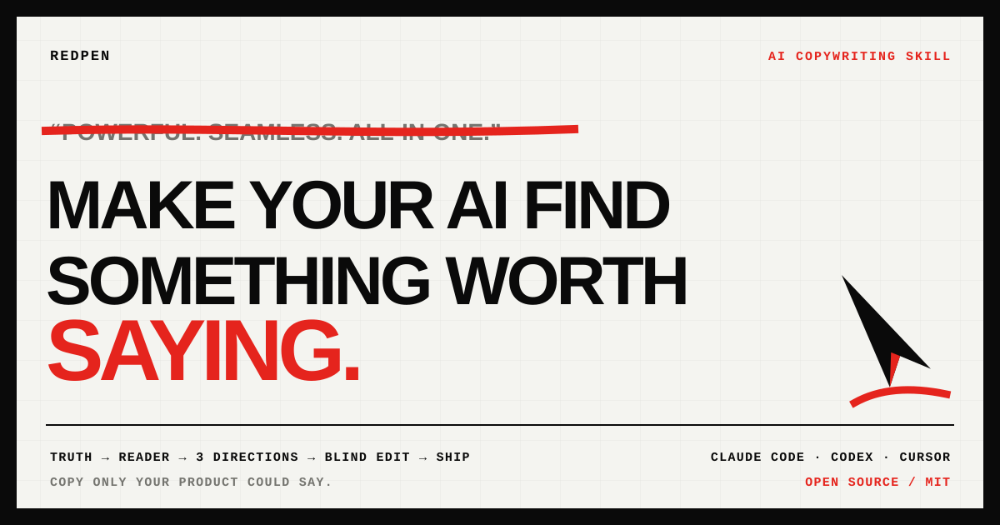

<p align="center">
  <a href="https://yerdaulet-damir.github.io/redpen/">
    
  </a>
</p>

<h1 align="center">Redpen</h1>

<p align="center"><strong>AI copywriting with taste for Claude Code, Codex, Cursor, Cline, Windsurf, and Copilot.</strong></p>

<p align="center">
  Write landing pages, headlines, emails, launch posts, product copy, and scripts rooted in product facts competitors cannot honestly claim.
</p>

<p align="center">
  <a href="#install"><strong>Install</strong></a> ·
  <a href="skills/redpen/SKILL.md"><strong>Read the skill</strong></a> ·
  <a href="examples/"><strong>See examples</strong></a> ·
  <a href="benchmarks/"><strong>Inspect the benchmark</strong></a> ·
  <a href="CONTRIBUTING.md"><strong>Contribute taste</strong></a>
</p>

---

Most AI copy tools begin by drafting. Redpen begins by finding **what is true, who needs to hear it, and what that person is living through right now**. Only then does it write.

Give it a rough brief or an existing page. Redpen builds a truth ledger, enters one reader's real moment, develops three genuinely different creative directions, compares them blind, and rewrites the winner until the copy feels discovered rather than generated.

## From a claim anyone could make to a moment one reader knows

> **Before:** Never worry about unpaid invoices again.
>
> **After:** **The invoice tab you reopen every Friday can follow up without you.**
>
> Approve the reminder once. It sends on your schedule when an invoice turns overdue.

The rewrite does not sprinkle personality onto the same claim. It uses a supplied product truth and a repeated moment from the reader's week. The first line creates recognition; the second earns belief.

Redpen can write from zero, rewrite a weak draft, compare alternatives, or edit a long page. It is not an AI detector, a synonym spinner, or another list of banned phrases.

## Help build the voice AI does not find by averaging

Redpen is open source because taste should not collapse into one person's list
of favorite lines. Copywriters, founders, designers, researchers, and people
with a sharp ear are invited to contribute real briefs, reader moments,
before/after edits, benchmark cases, and methods that make an agent find a
point of view instead of predicting the safest next phrase.

A useful contribution gives the agent better evidence, a more exact reader, a
real tension, or a harder editorial choice. It does not add another headline
formula, a longer banned-word list, fake vulnerability, or instructions to
sprinkle slang over generic copy.

Start with the [contribution guide](CONTRIBUTING.md). Bring work a human editor
would stop at, argue over, and remember.

## The three questions are gates, not the engine

Every finished sentence still runs all three. A line that fails one gets cut.

| Question | Fails | Passes |
|---|---|---|
| **1. Can I visualize it?** | "Change an entire industry" — you see nothing | "Worn by supermodels in London and dads in Ohio" — you see it |
| **2. Can I falsify it?** | "He has great values" — air | "He reads on the tube" — provably true or false, so you sit up |
| **3. Can nobody else say it?** | "Don't just get a job" — any recruiter can sign it | "Your car has five numbers on the speedometer. Volvo has six." — only Volvo can say it |

Three no's and you're writing rubbish. Three yes's means the line is eligible to
ship. It does not mean the line has recognition, tension, trust, or feeling.

## What Redpen does before those questions

1. **Truth ledger** — separates observed facts, user-provided facts, inference,
   and unknowns. No invented proof.
2. **Reader moment** — finds one scene, one private sentence, one pressure, and
   one concrete after-state. Not a persona deck.
3. **Creative territories** — writes a lived scene, a sharp fact or contrast,
   and a mechanism or identity argument. Not three synonym swaps.
4. **Blind preference loop** — compares candidates as a rushed reader, a
   skeptical buyer, and an experienced editor. It quotes the winning fragment,
   names the losing defect, and revises only that defect.
5. **Finishing gates** — visual, falsifiable, ownable, understood in two
   seconds, natural aloud, and faithful to the evidence.

Emotion is not added with words such as *delightful* or *empowering*. Redpen
causes it with a scene, a consequence, a tradeoff, or a detail the reader
recognizes from their own day.

## Before → after

Illustrative briefs. The right side uses supplied product truth and a specific
reader moment rather than replacing adjectives with better adjectives.

| Slop | Redpen |
|---|---|
| "Seamless alerts that keep developers informed anywhere." | **"Like `console.log`, but it arrives on your phone."** |
| "The easiest way to record and share your screen." | **"Record the bug before the meeting starts. No desktop app."** |
| "AI-powered reminders that eliminate payment stress." | **"The invoice tab you reopen every Friday can follow up without you."** |
| "A powerful productivity app that helps you get more done." | **"Every task you'll do today, on one screen, sorted by what's overdue."** |

Each line on the right starts from something visible or verifiable. More
importantly, each one meets a reader in a recognizable moment.

## Install

Redpen is one ruleset with adapters for several popular agents. Pick yours.

**Claude Code** — copy the complete [`skills/redpen/`](skills/redpen/) directory into `.claude/skills/redpen/`, then invoke with `/redpen` or just write copy while it is active.

```bash
mkdir -p .claude/skills/redpen
cp -R skills/redpen/. .claude/skills/redpen/
```

**Codex** — install the same skill directory globally, or bring [`AGENTS.md`](AGENTS.md) into the project you want Redpen to govern.

```bash
mkdir -p ~/.codex/skills/redpen
cp -R skills/redpen/. ~/.codex/skills/redpen/
```

**Cursor** — copy [`.cursor/rules/redpen.mdc`](.cursor/rules/redpen.mdc) into your project's `.cursor/rules/`.

**Cline** — copy [`.clinerules/redpen.md`](.clinerules/redpen.md) into `.clinerules/`.

**Windsurf** — copy [`.windsurf/rules/redpen.md`](.windsurf/rules/redpen.md).

**GitHub Copilot** — copy [`.github/copilot-instructions.md`](.github/copilot-instructions.md).

**Any other agent** — point it at [`AGENTS.md`](AGENTS.md).

## Same product, three readers

The reader moment is not a persona field. It changes which true thing goes first.

One product, one supplied fact — *it reads the last 200 merged PRs in your repo before reviewing the next one* — and three readers standing in different places:

| Where the reader is standing | What Redpen leads with |
|---|---|
| Has three AI review tools installed and ignores all of them | **"It reads your last 200 merged PRs before it reviews the next one."** The mechanism — the part a rival can't sign. |
| Tired of a third round of nitpicks, doesn't know tools like this exist | **"The nitpicks are fixed before your reviewer opens the tab."** The outcome, said plainly. |
| Doesn't consider review a problem worth solving | **"Every reviewer on your team enforces a slightly different rulebook."** No product, no claim — recognition, and a reason to read line two. |

Same truth ledger. All three pass the finishing gates. Only one is right for a
given reader — and the three questions cannot tell you which, because they test
the sentence, not the situation.

Worked version of this brief: [same product, three readers](examples/diagnose-before-you-write.md).

## How it works

Once active, Redpen runs the editorial loop, then finishes the winning line
with a short set of reflexes:

- **Point, don't talk.** Don't say "great investment" — point at the 50-year price chart.
- **Facts over adjectives.** If in doubt, give a fact. A fact is precise, true, and you can build a story on it.
- **Any word that isn't working for you is working against you.** Cross it out.
- **Concrete over abstract.** "Songs in your pocket," not "songs in your media player."
- **Conflict.** Hinge the line on an unspoken *but*. "Designed to be deleted."
- **One desire per ad.** The word "and" in a headline is a leak.
- **Shorter headline, longer proof.** Cut the headline to one line. But body copy is as long as the distance to belief — cutting copy that's still working is quitting the sale early.
- **Never write from the file cabinet.** Swapping your product into someone else's proven headline gets you an echo. It's also the default failure mode of a model writing from the average of everything it read.

Full ruleset: [`skills/redpen/SKILL.md`](skills/redpen/SKILL.md). The diagnosis layer in full — awareness ladder, sophistication ladder, the seven body-copy techniques: [`skills/redpen/reference/schwartz.md`](skills/redpen/reference/schwartz.md). Worked examples: [`examples/`](examples/).

## FAQ

**How do I stop my AI copy from sounding generic?**
Generic AI copy usually starts before the model has found a real fact, reader
moment, or argument. Redpen delays drafting, develops distinct territories,
compares them, and then requires the winner to be concrete, falsifiable, and
ownable. The gates remove filler; the editorial loop finds what is worth saying.

**What are the three questions to test a headline?**
Can I visualize it? Can I falsify it? Can nobody else say it? Run all three on every finished line; cut anything that fails one. Passing all three makes a line concrete, credible, and ownable. It does not guarantee the line meets a real reader in a real moment, which is why Redpen runs its truth, reader, and preference loop first.

**Can Claude / Cursor write good marketing copy?**
It can, but another request to "make it punchier" usually produces a smoother
average. Redpen installs a repeatable editorial process: evidence first,
reader moment second, distinct arguments third, comparison before polish, and
finishing gates last.

**What's the difference between concrete and abstract copy?**
Abstract copy ("a better way," "empower creators") can't be dropped on your foot — you can't see it, so you won't remember it. Concrete copy ("1,000 songs in your pocket") is a thing you can picture. Concrete wins every time.

**What are the 5 stages of customer awareness?**
Most aware (knows the product, wants it), product aware (knows it, isn't sold), solution aware (wants the outcome, doesn't know you exist), problem aware (feels the problem, doesn't know it's fixable), and unaware (no problem in mind at all). Eugene Schwartz's ladder from *Breakthrough Advertising*. The general direction: the less the reader already knows, the less your opening line leans on the product and the more it has to be about them. Redpen uses it while modelling the reader's moment, before it drafts.

**What are the 5 stages of market sophistication?**
Roughly: you're first (state the claim plainly), rivals repeat it (intensify or enlarge the claim), the claims stop being believed (lead with the mechanism instead), the mechanism gets copied (extend the mechanism), and the market stops listening altogether (drop claims and write identification). Schwartz's point is that the ownable thing moves as a market ages — which is a more useful answer to "make this more unique" than adding adjectives.

**Why does my headline sound good but not convert?**
A well-made sentence can still be aimed at the wrong moment. Before rewriting the words, check what the reader already knows, what they have already been promised by others, and what they walked in distrusting. Reading a handful of competitor pages usually shows you which arguments the market has stopped hearing.

**What are Harry Dry's three questions?**
Can I visualize it? Can I falsify it? Can nobody else say it? Harry Dry — of Marketing Examples — asks these of every sentence he writes. Three no's and you're writing rubbish; three yes's and you're onto something. Redpen uses them as final gates after it has found the product truth and reader moment.

**What is the Harry Dry copywriting method?**
Make it visual (something you can picture), make it falsifiable (provably true
or false, not an adjective), and make it so specific no competitor could sign
it. Then point, don't talk — show a fact instead of describing a feeling. Harry
Dry breaks this down in his [76-minute copywriting talk](https://www.youtube.com/watch?v=TUMjnmfsPeM)
on the *How I Write* podcast. Redpen uses those questions as final quality gates.

## The methods behind Redpen

Redpen combines **Harry Dry's** finishing discipline, **Eugene Schwartz's** market diagnosis, and a blind editorial preference loop designed for AI agents. The loop is the missing part: it compares distinct arguments, keeps the load-bearing human phrase, and revises from a named loss instead of asking the model to "make it better" again.

The three questions come straight from his framework, laid out in his **[76-minute copywriting breakdown](https://www.youtube.com/watch?v=TUMjnmfsPeM)** on David Perell's *How I Write* podcast. If a line can't be visualized, can't be falsified, and could be signed by a competitor, it gets cut. Harry teaches it with the ads everyone remembers — New Balance's "supermodels in London and dads in Ohio," The Economist, Volkswagen, Hinge's "designed to be deleted," Couch to 5K — plus Kaplan's Law of Words: *any word that isn't working for you is working against you.*

Redpen does not replace the original work. [Watch the talk](https://www.youtube.com/watch?v=TUMjnmfsPeM)
and read [Marketing Examples](https://marketingexamples.com) for Harry's examples and reasoning.

The reader-diagnosis stage draws on **Eugene Schwartz**, *Breakthrough Advertising* (1966) — in particular his argument that a headline lifted from elsewhere produces an ad that merely reminds people of something else, and that what's worth hunting is the element unique to this product and this market. That is a fair description of what a language model does by default. Redpen folds his diagnosis into the reader-moment step rather than treating it as a separate framework. Read the book; [`reference/schwartz.md`](skills/redpen/reference/schwartz.md) is a working compass, not a substitute.

## How we test whether the skill changes output

The [`benchmarks/`](benchmarks/) folder compares a generic copywriter prompt
against Redpen on six briefs. A separate judge sees anonymous candidates in
both orders and scores recognition, pull, trust, emotional movement,
ownability, and cadence. Invented facts and fake emotion are hard failures.

The order swap matters: if a judge picks the first answer both times, the case
is unstable, not a Redpen win. A selected candidate with a hard failure is
disqualified before the mirrored verdict is counted. Every run records the
model, UTC timestamp, commit, skill hash, and raw judgments so a result can be
audited instead of repeated as a marketing claim.

The [2026-08-02 Claude Sonnet 4.6 verification run](benchmarks/runs/claude-sonnet-4-6-2026-08-02.json)
produced **six Redpen wins in six stable mirrored cases**. That is a regression
baseline, not a claim that one model grading itself has measured human
conversion.

## License

MIT — use it, fork it, ship better copy.
